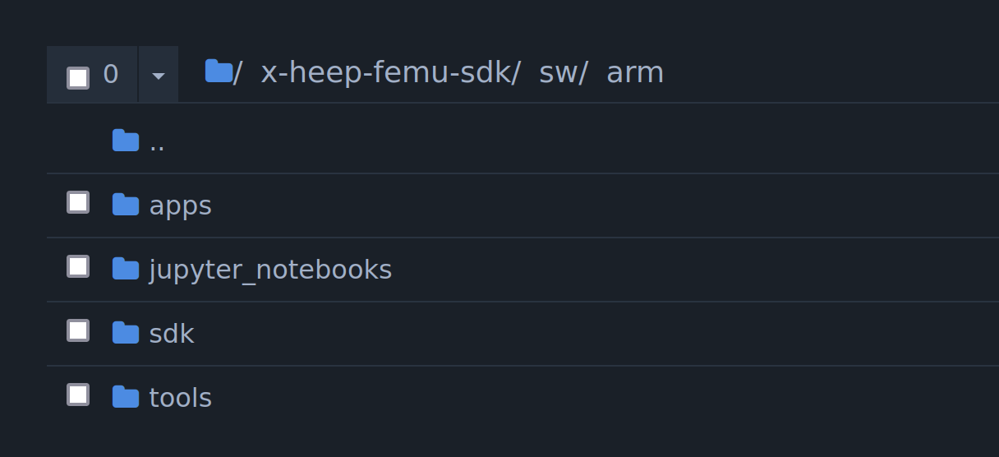
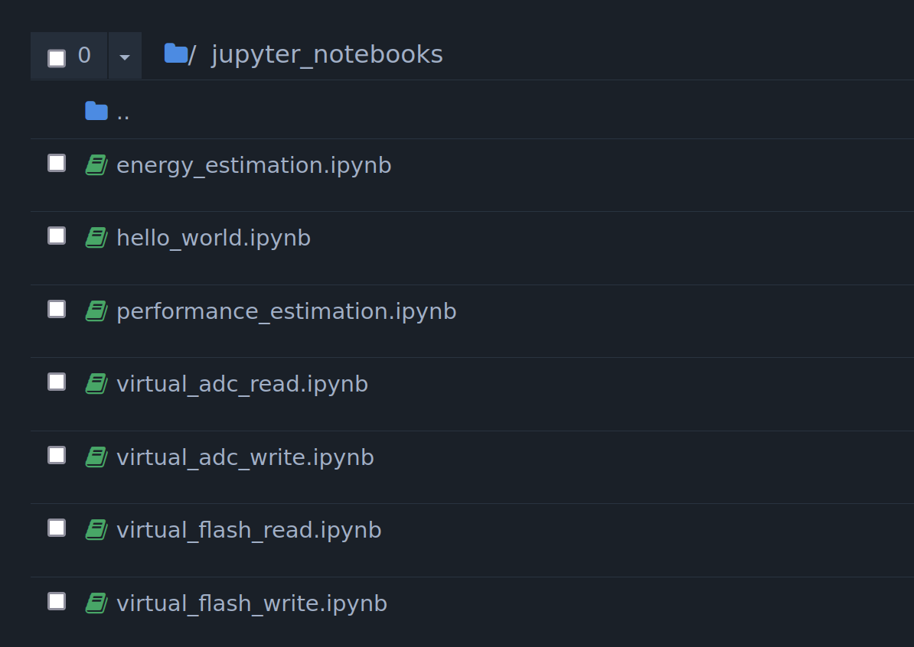
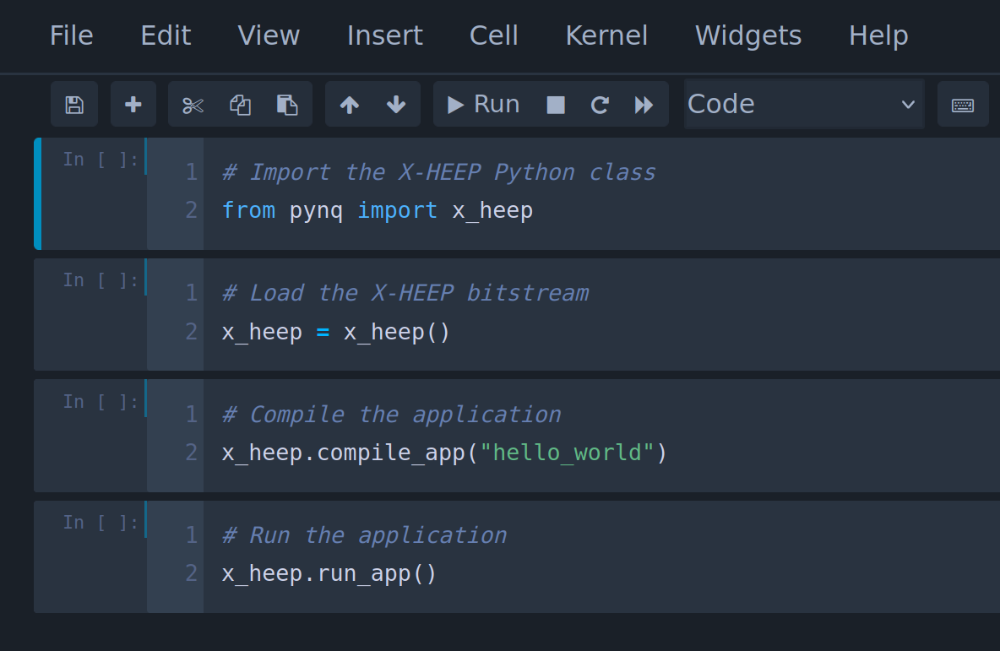
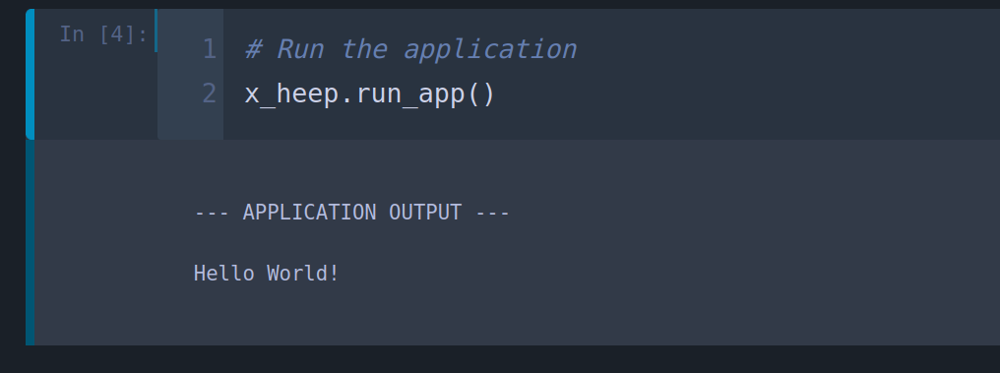

Getting started
---------------

This section shows how to get started with our FPGA platform running your first ``Hello World`` application.

You can do this in three different ways:

- ``Jupyter notebook`` (suggested)
- ``Python script``
- ``Python shell``

Jupyter notebook
^^^^^^^^^^^^^^^^

Connect to Linux, running on the board, using your Web browser and follow these steps.

Navigate to ``arm`` and click on ``jupyter_notebooks``:

Click on ``hello_world.ipynb``:

Run the Python code:

You will get this output:

Python script
^^^^^^^^^^^^^

Connect to Linux, running on the board, using SSH from your terminal and follow these steps.

Enter the X-HEEP FEMU SDK folder:

.. code-block:: console

    cd x-heep-femu-sdk/

Run sudo:

.. code-block:: console

    sudo su

Initialize the environment:

.. code-block:: console

    source ./init.sh

Navigate to the application folder:

.. code-block:: console

    cd sw/arm/apps/hello_world/

Run the ``Hello World`` application:

.. code-block:: Python

    python3 hello_world.py

You will get this output:

.. code-block:: console

    --- APPLICATION OUTPUT ---

    Hello World!

Python shell
^^^^^^^^^^^^

Connect to Linux, running on the board, using SSH from your terminal and follow these steps.

Enter the X-HEEP FEMU SDK folder:

.. code-block:: console

    cd x-heep-femu-sdk/

Run sudo:

.. code-block:: console

    sudo su

Initialize the environment:

.. code-block:: console

    source ./init.sh

Start the Python3 shell:

.. code-block:: console

    python3

Run the ``Hello World`` application with this Python code:

.. code-block:: Python

    # Import the X-HEEP Python class
    from pynq import x_heep

    # Load the X-HEEP bitstream
    x_heep = x_heep()

    # Compile the application
    x_heep.compile_app("hello_world")

    # Run the application
    x_heep.run_app()

You will get this output:

.. code-block:: console

    --- APPLICATION OUTPUT ---

    Hello World!

.. note::

  You can use the ``Python script`` and ``Python shell`` methods to debug the ``Hello World`` application (or your own application). You only need to substitute the ``run_app()`` function with the ``run_app_debug()`` function in the code. You can now debug the application with GDB!

.. warning::

  Debugging is NOT supported by the ``Jupyter notebook`` method!
