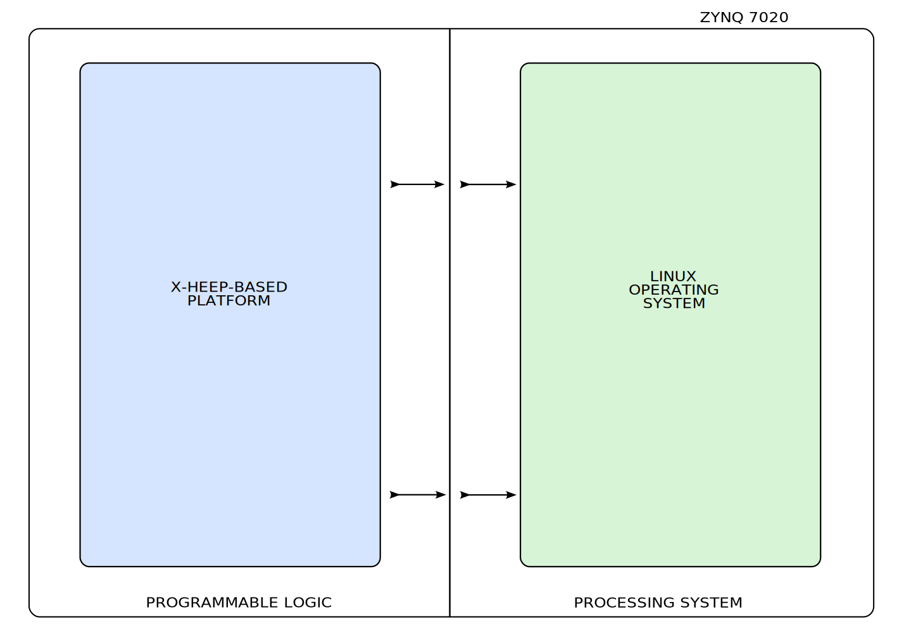

Hardware
========

This section describes in detail our platform's hardware implemented on the PL side of the chip. It includes our X-HEEP microcontroller in combination with additional modules, used to implement the communication with the PS side on the chip and support the different platform's functionalities.

.. toctree::
    :maxdepth: 1

    hardware/x_heep.rst
    hardware/periph_virt.rst
    hardware/perf_cnt.rst
    hardware/off_board_connect.rst
