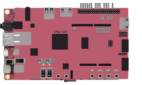

Off-board connectivity
======================

Our FPGA platform offers off-board connectivity to allow the user to extend the design with his own sensors' boards. 

The available external interfaces are:

- ``SPI``
- ``I2C``
- ``GPIO[31:2]``
- ``reset``

The connections are detailed in the following table:

+----------------+----------------+-------------------------------------------------+
| X-HEEP pin     | Zynq-7020 pin  | Pynq-Z2                                         |
+================+================+=================================================+
| rst_i          | L19            | BTN3                                            |
+----------------+----------------+-------------------------------------------------+
| rst_led        | M14            | LED3                                            |
+----------------+----------------+-------------------------------------------------+
| spi2_sck_io    | T14            | AR0                                             |
+----------------+----------------+-------------------------------------------------+
| spi2_cs_0_io   | U12            | AR1                                             |
+----------------+----------------+-------------------------------------------------+
| spi2_cs_1_io   | U13            | AR2                                             |
+----------------+----------------+-------------------------------------------------+
| spi2_sd_0_io   | V13            | AR3                                             |
+----------------+----------------+-------------------------------------------------+
| spi2_sd_1_io   | V15            | AR4                                             |
+----------------+----------------+-------------------------------------------------+
| spi2_sd_2_io   | T15            | AR5                                             |
+----------------+----------------+-------------------------------------------------+
| spi2_sd_3_io   | R16            | AR6                                             |
+----------------+----------------+-------------------------------------------------+
| i2c_scl_io     | P15            | SCL                                             |
+----------------+----------------+-------------------------------------------------+
| i2c_sda_io     | P16            | SDA                                             |
+----------------+----------------+-------------------------------------------------+
| gpio_io[2]     | V6             | RP7                                             |
+----------------+----------------+-------------------------------------------------+
| gpio_io[3]     | U7             | RP11                                            |
+----------------+----------------+-------------------------------------------------+
| gpio_io[4]     | V7             | RP13                                            |
+----------------+----------------+-------------------------------------------------+
| gpio_io[5]     | U8             | RP15                                            |
+----------------+----------------+-------------------------------------------------+
| gpio_io[6]     | V8             | RP19                                            |
+----------------+----------------+-------------------------------------------------+
| gpio_io[7]     | V10            | RP21                                            |
+----------------+----------------+-------------------------------------------------+
| gpio_io[8]     | W10            | RP23                                            |
+----------------+----------------+-------------------------------------------------+
| gpio_io[9]     | Y16            | RP27                                            |
+----------------+----------------+-------------------------------------------------+
| gpio_io[10]    | Y6             | RP29                                            |
+----------------+----------------+-------------------------------------------------+
| gpio_io[11]    | Y7             | RP31                                            |
+----------------+----------------+-------------------------------------------------+
| gpio_io[12]    | W8             | RP33                                            |
+----------------+----------------+-------------------------------------------------+
| gpio_io[13]    | Y8             | RP35                                            |
+----------------+----------------+-------------------------------------------------+
| gpio_io[14]    | W9             | RP37                                            |
+----------------+----------------+-------------------------------------------------+
| gpio_io[15]    | Y18            | RP8                                             |
+----------------+----------------+-------------------------------------------------+
| gpio_io[16]    | Y19            | RP10                                            |
+----------------+----------------+-------------------------------------------------+
| gpio_io[17]    | C20            | RP12                                            |
+----------------+----------------+-------------------------------------------------+
| gpio_io[18]    | W6             | RP16                                            |
+----------------+----------------+-------------------------------------------------+
| gpio_io[19]    | U18            | RP18                                            |
+----------------+----------------+-------------------------------------------------+
| gpio_io[20]    | M15            | LED5 Red                                        |
+----------------+----------------+-------------------------------------------------+
| gpio_io[21]    | G14            | LED5 Blue                                       |
+----------------+----------------+-------------------------------------------------+
| gpio_io[22]    | L14            | LED5 Green                                      |
+----------------+----------------+-------------------------------------------------+
| gpio_io[23]    | N15            | LED4 Red                                        |
+----------------+----------------+-------------------------------------------------+
| gpio_io[24]    | L15            | LED4 Blue                                       |
+----------------+----------------+-------------------------------------------------+
| gpio_io[25]    | G17            | LED4 Green                                      |
+----------------+----------------+-------------------------------------------------+
| gpio_io[26]    | R14            | LED0                                            |
+----------------+----------------+-------------------------------------------------+
| gpio_io[27]    | P14            | LED1                                            |
+----------------+----------------+-------------------------------------------------+
| gpio_io[28]    | N16            | LED2                                            |
+----------------+----------------+-------------------------------------------------+
| gpio_io[29]    | D19            | BTN0                                            |
+----------------+----------------+-------------------------------------------------+
| gpio_io[30]    | D20            | BTN1                                            |
+----------------+----------------+-------------------------------------------------+
| gpio_io[31]    | L20            | BTN2                                            |
+----------------+----------------+-------------------------------------------------+
