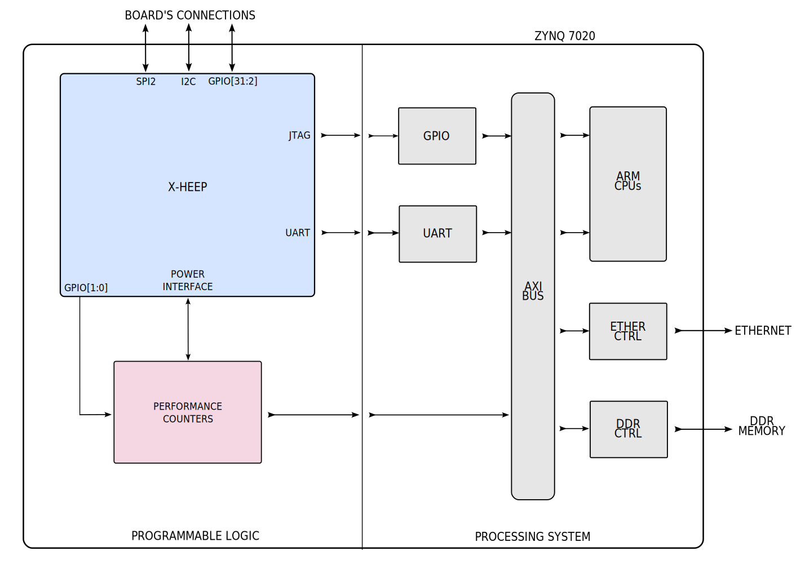

Performance counters
====================

We added to the platform a set of performance counters that allows counting the number of clock cycles that each module in the X-HEEP architecture spends in each of its available low-power modes: active, clock-gated, power-gated and retentive. The IP extracts information from our X-HEEP microcontroller thanks to a dedicated power interface that exposes important control signals. These signals are used internally as enables to increase or not our performance counters. The IP also features an AXI4 slave interface, connected to the ARM bus on the PS side of the chip, that can be used for configuration or for reading the values of the counters. The performance counters can be started in two modes: ``automatic mode`` or ``manual mode``. In the ``automatic mode``, the counters start and stop automatically at the beginning and at the end of your running application, without requiring any additional action. In the ``manual mode``, instead, the counters are started and stopped manually by driving pin GPIO[1] (connected to the performance counter's IP) from your application. This mode allows the user to perform more fine-grained analysis, calculating the performance of even very small pieces of code inside the application.  

The available registers/counters are the following:

+---------------+---------+------------------------+------------------+------------------------------+
| Offset        | Bits    | Type                   | Description                                     |
+===============+=========+========================+=================================================+
| 0x0000        | [0]     | Control register       | Reset: 1                                        |
+---------------+---------+------------------------+-------------------------------------------------+
| 0x0004        | [1:0]   | Control register       | Stop: 00 -                                      |
|               |         |                        | Start automatic: 01 -                           |
|               |         |                        | Start manual: 10                                |
+---------------+---------+------------------------+-------------------------------------------------+
| 0x0008        | [31:0]  | Performance counter    | Total cycles                                    |
+---------------+---------+------------------------+-------------------------------------------------+
| 0x000C        | [31:0]  | Performance counter    | CPU - Active cycles                             |
+---------------+---------+------------------------+-------------------------------------------------+
| 0x0010        | [31:0]  | Performance counter    | CPU - Clock-gate cycles                         |
+---------------+---------+------------------------+-------------------------------------------------+
| 0x0014        | [31:0]  | Performance counter    | CPU - Power-gate cycles                         |
+---------------+---------+------------------------+-------------------------------------------------+
| 0x0018        | [31:0]  | Performance counter    | Bus always-on - Active cycles                   |
+---------------+---------+------------------------+-------------------------------------------------+
| 0x001C        | [31:0]  | Performance counter    | Bus always-on - Clock-gate cycles               |
+---------------+---------+------------------------+-------------------------------------------------+
| 0x0020        | [31:0]  | Performance counter    | Debug always-on - Active cycles                 |
+---------------+---------+------------------------+-------------------------------------------------+
| 0x0024        | [31:0]  | Performance counter    | Debug always-on - Clock-gate cycles             |
+---------------+---------+------------------------+-------------------------------------------------+
| 0x0028        | [31:0]  | Performance counter    | SoC controller always-on - Active cycles        |
+---------------+---------+------------------------+-------------------------------------------------+
| 0x002C        | [31:0]  | Performance counter    | SoC controller always-on - Clock-gate cycles    |
+---------------+---------+------------------------+-------------------------------------------------+
| 0x0030        | [31:0]  | Performance counter    | Boot ROM always-on - Active cycles              |
+---------------+---------+------------------------+-------------------------------------------------+
| 0x0034        | [31:0]  | Performance counter    | Boot ROM always-on - Clock-gate cycles          |
+---------------+---------+------------------------+-------------------------------------------------+
| 0x0038        | [31:0]  | Performance counter    | SPI Flash always-on - Active cycles             |
+---------------+---------+------------------------+-------------------------------------------------+
| 0x003C        | [31:0]  | Performance counter    | SPI Flash always-on - Clock-gate cycles         |
+---------------+---------+------------------------+-------------------------------------------------+
| 0x0040        | [31:0]  | Performance counter    | SPI always-on - Active cycles                   |
+---------------+---------+------------------------+-------------------------------------------------+
| 0x0044        | [31:0]  | Performance counter    | SPI always-on - Clock-gate cycles               |
+---------------+---------+------------------------+-------------------------------------------------+
| 0x0048        | [31:0]  | Performance counter    | Power manager always-on - Active cycles         |
+---------------+---------+------------------------+-------------------------------------------------+
| 0x004C        | [31:0]  | Performance counter    | Power manager always-on - Clock-gate cycles     |
+---------------+---------+------------------------+-------------------------------------------------+
| 0x0050        | [31:0]  | Performance counter    | Timer always-on - Active cycles                 |
+---------------+---------+------------------------+-------------------------------------------------+
| 0x0054        | [31:0]  | Performance counter    | Timer always-on - Clock-gate cycles             |
+---------------+---------+------------------------+-------------------------------------------------+
| 0x0058        | [31:0]  | Performance counter    | DMA always-on - Active cycles                   |
+---------------+---------+------------------------+-------------------------------------------------+
| 0x005C        | [31:0]  | Performance counter    | DMA always-on - Clock-gate cycles               |
+---------------+---------+------------------------+-------------------------------------------------+
| 0x0060        | [31:0]  | Performance counter    | Fast inter ctrl always on - Active cycles       |
+---------------+---------+------------------------+-------------------------------------------------+
| 0x0064        | [31:0]  | Performance counter    | Fast inter ctrl always on - Clock-gate cycles   |
+---------------+---------+------------------------+-------------------------------------------------+
| 0x0068        | [31:0]  | Performance counter    | GPIO always-on - Active cycles                  |
+---------------+---------+------------------------+-------------------------------------------------+
| 0x006C        | [31:0]  | Performance counter    | GPIO always-on - Clock-gate cycles              |
+---------------+---------+------------------------+-------------------------------------------------+
| 0x0070        | [31:0]  | Performance counter    | UART always-on - Active cycles                  |
+---------------+---------+------------------------+-------------------------------------------------+
| 0x0074        | [31:0]  | Performance counter    | UART always-on - Clock-gate cycles              |
+---------------+---------+------------------------+-------------------------------------------------+
| 0x0078        | [31:0]  | Performance counter    | PLIC - Active cycles                            |
+---------------+---------+------------------------+-------------------------------------------------+
| 0x007C        | [31:0]  | Performance counter    | PLIC - Clock-gate cycles                        |
+---------------+---------+------------------------+-------------------------------------------------+
| 0x0080        | [31:0]  | Performance counter    | PLIC - Power-gate cycles                        |
+---------------+---------+------------------------+-------------------------------------------------+
| 0x0084        | [31:0]  | Performance counter    | GPIO - Active cycles                            |
+---------------+---------+------------------------+-------------------------------------------------+
| 0x0088        | [31:0]  | Performance counter    | GPIO - Clock-gate cycles                        |
+---------------+---------+------------------------+-------------------------------------------------+
| 0x008C        | [31:0]  | Performance counter    | GPIO - Power-gate cycles                        |
+---------------+---------+------------------------+-------------------------------------------------+
| 0x0090        | [31:0]  | Performance counter    | I2C - Active cycles                             |
+---------------+---------+------------------------+-------------------------------------------------+
| 0x0094        | [31:0]  | Performance counter    | I2C - Clock-gate cycles                         |
+---------------+---------+------------------------+-------------------------------------------------+
| 0x0098        | [31:0]  | Performance counter    | I2C - Power-gate cycles                         |
+---------------+---------+------------------------+-------------------------------------------------+
| 0x009C        | [31:0]  | Performance counter    | Timer - Active cycles                           |
+---------------+---------+------------------------+-------------------------------------------------+
| 0x00A0        | [31:0]  | Performance counter    | Timer - Clock-gate cycles                       |
+---------------+---------+------------------------+-------------------------------------------------+
| 0x00A4        | [31:0]  | Performance counter    | Timer - Power-gate cycles                       |
+---------------+---------+------------------------+-------------------------------------------------+
| 0x00A8        | [31:0]  | Performance counter    | SPI - Active cycles                             |
+---------------+---------+------------------------+-------------------------------------------------+
| 0x00AC        | [31:0]  | Performance counter    | SPI - Clock-gate cycles                         |
+---------------+---------+------------------------+-------------------------------------------------+
| 0x00B0        | [31:0]  | Performance counter    | SPI - Power-gate cycles                         |
+---------------+---------+------------------------+-------------------------------------------------+
| 0x00B4        | [31:0]  | Performance counter    | RAM bank 0 - Active cycles                      |
+---------------+---------+------------------------+-------------------------------------------------+
| 0x00B8        | [31:0]  | Performance counter    | RAM bank 0 - Clock-gate cycles                  |
+---------------+---------+------------------------+-------------------------------------------------+
| 0x00BC        | [31:0]  | Performance counter    | RAM bank 0 - Power-gate cycles                  |
+---------------+---------+------------------------+-------------------------------------------------+
| 0x00C0        | [31:0]  | Performance counter    | RAM bank 0 - Retentive cycles                   |
+---------------+---------+------------------------+-------------------------------------------------+
| 0x00C4        | [31:0]  | Performance counter    | RAM bank 1 - Active cycles                      |
+---------------+---------+------------------------+-------------------------------------------------+
| 0x00C8        | [31:0]  | Performance counter    | RAM bank 1 - Clock-gate cycles                  |
+---------------+---------+------------------------+-------------------------------------------------+
| 0x00CC        | [31:0]  | Performance counter    | RAM bank 1 - Power-gate cycles                  |
+---------------+---------+------------------------+-------------------------------------------------+
| 0x00D0        | [31:0]  | Performance counter    | RAM bank 1 - Retentive cycles                   |
+---------------+---------+------------------------+-------------------------------------------------+
| 0x00D4        | [31:0]  | Performance counter    | RAM bank 2 - Active cycles                      |
+---------------+---------+------------------------+-------------------------------------------------+
| 0x00D8        | [31:0]  | Performance counter    | RAM bank 2 - Clock-gate cycles                  |
+---------------+---------+------------------------+-------------------------------------------------+
| 0x00DC        | [31:0]  | Performance counter    | RAM bank 2 - Power-gate cycles                  |
+---------------+---------+------------------------+-------------------------------------------------+
| 0x00E0        | [31:0]  | Performance counter    | RAM bank 2 - Retentive cycles                   |
+---------------+---------+------------------------+-------------------------------------------------+
| 0x00E4        | [31:0]  | Performance counter    | RAM bank 3 - Active cycles                      |
+---------------+---------+------------------------+-------------------------------------------------+
| 0x00E8        | [31:0]  | Performance counter    | RAM bank 3 - Clock-gate cycles                  |
+---------------+---------+------------------------+-------------------------------------------------+
| 0x00EC        | [31:0]  | Performance counter    | RAM bank 3 - Power-gate cycles                  |
+---------------+---------+------------------------+-------------------------------------------------+
| 0x00F0        | [31:0]  | Performance counter    | RAM bank 3 - Retentive cycles                   |
+---------------+---------+------------------------+-------------------------------------------------+
