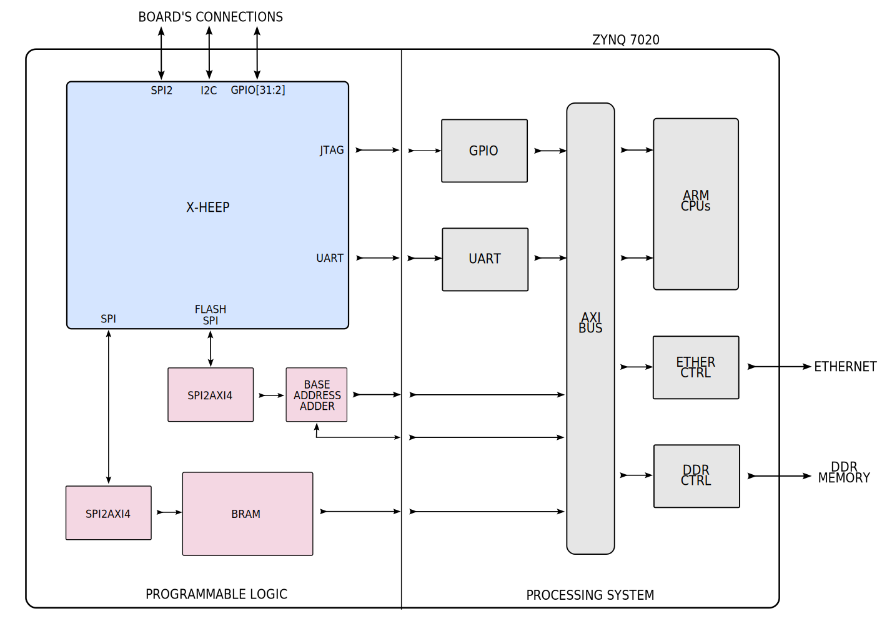

Peripheral virtualizations
==========================

JTAG virtualization
-------------------

We connected the JTAG port of our X-HEEP microcontroller to the GPIO peripheral available on the PS side of the chip. In this way, we are able to implement the JTAG protocol from Linux driving the needed GPIO signals.

UART virtualization
-------------------

We connected the UART port of our X-HEEP microcontroller to the UART peripheral available on the PS side of the chip. In this way, we are able to get the stdout of the applications running on X-HEEP.

Flash virtualization
--------------------

We virtualized a Flash memory into the board DDR RAM. The virtual memory may be used to store the input data needed by the application running on X-HEEP or the output results of the computations. For this implementation, we added two modules: a ``SPI to AXI4 bridge`` and an ``base address adder``. The ``SPI to AXI4 bridge`` is used to convert SPI read and write transactions into the corresponding AXI4 transactions. It has one SPI slave interface connected to the SPI Flash master port of X-HEEP and one AXI4 master interface connected to the ARM bus on the PS side of the chip. This allows the code running on X-HEEP to perform read and write operations to the virtual Flash, instantiated into the DDR RAM of the board. The ``base address adder`` is used to add the base address of the virtual Flash in the DDR RAM to the address of the read and write transactions. It has one AXI4 slave interface connected to the ARM bus on the PS side of the chip that allows programming the base address at runtime.

The available ``base address adder`` registers are the following:

+---------------+---------+------------------------+------------------+------------------------------+
| Offset        | Bits    | Type                   | Description                                     |
+===============+=========+========================+=================================================+
| 0x0000        | [31:0]  | Control register       | Virtual Flash base address                      |
+---------------+---------+------------------------+-------------------------------------------------+

ADC virtualization
------------------

We virtualized an analogue-to-digital converter (ADC) into the Block RAM (BRAM) present on the PL side of the chip. This virtual ADC memory may be used to store the samples that come from real sensors' acquisitions. For this implementation, we added two modules: a ``SPI to AXI4 bridge`` and a ``BRAM memory``. The ``SPI to AXI4 bridge`` is used to convert SPI read and write transactions into the corresponding AXI4 transactions. It has one SPI slave interface connected to the SPI master port of X-HEEP and one AXI4 master interface connected to the BRAM memory. This allows the code running on X-HEEP to perform a virtual acquisition by reading the samples stored in the virtual ADC (BRAM memory) at any rate. The ``BRAM memory`` has one AXI4 slave interface connected to the ARM bus on the PS side of the chip that allows filling the memory with the sampled data needed by the running application. In the current implementation, the size of the used BRAM memory is 8KB.

.. note::
   Our team is working on a new virtual ADC implementation that will enable performing very long acquisitions (of more than 8KB) thanks to a more advanced data transfer synchronization between the external DDR memory and the BRAM!
